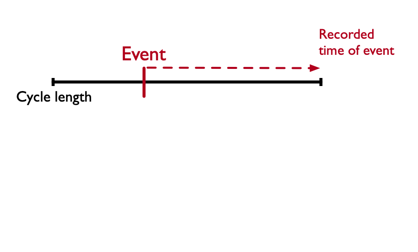
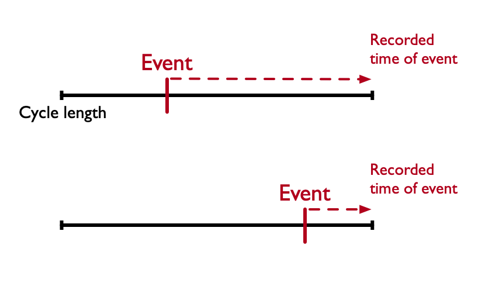
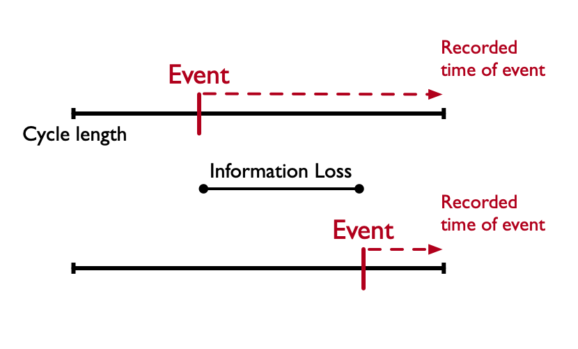

# Overview 

```{r}
library(knitr)
library(kableExtra)
```

## Overview

::: incremental
  - Brief biography
  - A (brief) overview of decision modelling approaches. 
  - A taxonomy of errors in decision modelling. 
  - What does DES buy you? 
  - Basic terminology and visualisation of DES.
  
:::

## Overview

::: incremental
  - Computational considerations for DES. 
  - A worked example of DES for health economic modelling. 
:::

# A (short) biography

## Introduction

- Professor at Vanderbilt University Medical Center and Vanderbilt Owen Graduate School of Management
- At Vanderbilt since 2011. 
- Prior: Harvard University (Ph.D.), Sewanee: The University of the South (B.A.)

## Sewanee: "The Oxford of the South"


## Sewanee: "The Oxford of the South"

{fig-align="center"}

## {background-image="images/vchem-summary.png" background-size="contain" background-position="center" background-repeat="no-repeat"}

## {background-image="images/graves-personalized1.png" background-size="contain" background-position="center" background-repeat="no-repeat"}

## {background-image="images/graves-personalized2.png" background-size="contain" background-position="center" background-repeat="no-repeat"}

## {background-image="images/vchem_cities_map.png" background-size="contain" background-position="center" background-repeat="no-repeat"}


```{r}
#| echo: false
#| warning: false
#| message: false
#| fig-width: 10
# Load required libraries
library(ggplot2)
library(maps)
library(dplyr)
library(ggrepel)

# Create a data frame with city coordinates
cities <- data.frame(
  city = c("Bangkok", "Berlin", "Istanbul", "Cape Town", "Bogota", 
           "Nashville", "Oxford", "Bali", "York"),
  country = c("Thailand", "Germany", "Turkey", "South Africa", "Colombia",
              "Tennessee, USA", "UK", "Indonesia", "UK"),
  lat = c(13.7563, 52.5200, 41.0082, -33.9249, 4.7110, 
          36.1627, 51.7520, -8.4095, 53.9590),
  lon = c(100.5018, 13.4050, 28.9784, 18.4241, -74.0721, 
          -86.7816, -1.2577, 115.1889, -1.0873)
)

# Get world map data
world_map <- map_data("world")

# Create the plot
world_cities_map <- ggplot() +
  # Add world map
  geom_polygon(data = world_map, 
               aes(x = long, y = lat, group = group), 
               fill = "lightgray", 
               color = "white", 
               size = 0.2) +
  
  # Add city points
  geom_point(data = cities, 
             aes(x = lon, y = lat), 
             color = "red", 
             size = 3, 
             alpha = 0.8) +
  
  # Add city labels with ggrepel to avoid overlapping
  geom_text_repel(data = cities, 
                  aes(x = lon, y = lat, label = city), 
                  size = 3.5, 
                  color = "darkblue", 
                  fontface = "bold",
                  box.padding = 0.5,
                  point.padding = 0.3,
                  segment.color = "gray50",
                  segment.size = 0.3) +
  
  # Customize the plot
  labs(title = "Workshop and Tutorial Locations",
       subtitle = "Vanderbilt Center for Health Economic Modeling",
       caption = "Data: Natural Earth via maps package") +
  
  # Use a nice projection and remove axis labels
  coord_fixed(1.3) +
  theme_void() +
  theme(
    plot.title = element_text(size = 16, face = "bold", hjust = 0.5),
    plot.subtitle = element_text(size = 12, hjust = 0.5, color = "gray50"),
    plot.caption = element_text(size = 8, color = "gray50"),
    plot.background = element_rect(fill = "white", color = NA),
    panel.background = element_rect(fill = "aliceblue", color = NA)
  )

# Display the plot
#print(world_cities_map)

# Optional: Save the plot
ggsave(here::here("content/images/vchem_cities_map.png"), plot = world_cities_map,
       width = 12, height = 8, dpi = 300, bg = "white")

# Health State: #6A6599FF
# Transition: #00A1D5FF
# Trajectory: #B24745FF
# Resource: #79AF97FF
# Event: #F44336
```


# A (brief) overview of decision modelling approaches {background-color="black"}

## {background-image="images/puzzle-1.png" background-size="contain" background-position="center" background-repeat="no-repeat"}

## {background-image="images/puzzle-2.png" background-size="contain" background-position="center" background-repeat="no-repeat"}

## {background-image="images/puzzle-3.png" background-size="contain" background-position="center" background-repeat="no-repeat"}

## {background-image="images/puzzle-4.png" background-size="contain" background-position="center" background-repeat="no-repeat"}

# {background-image="images/modeling-graves.png" background-size="contain" background-position="center" background-repeat="no-repeat"}

## {background-image="images/graves-dalys.png" background-size="contain" background-position="center" background-repeat="no-repeat"}

# Deterministic Models {background-color="dodgerblue"}

## 

<br><br><br><br>

### [Cohort-level]{style="color:crimson"} models that track [expected values]{style="color:lightseagreen"}.
 
## Deterministic Models

1. [Discrete Time Markov Cohort]{style="color:forestgreen"}
  - Characterized by transitions among mutually exclusive health states. 
  - Useful for expected outcomes, though possible to analytically solve for higher-order moments, e.g., variance, skewness; see @caswell2021a. 
  
## Deterministic Models

2. [Differential equations modelling]{style="color:forestgreen"}
  - Draws on stochastic process theory to represent systems using differential equations (DEQs).
  - Solutions to DEQs provide occupancy of underlying process at time $t$. 

# Stochastic Models {background-color="dodgerblue"}

## 

<br><br><br><br>


### [Individual-level]{style="color:crimson"} models that simulate patient pathways with [random]{style="color:lightseagreen"} variation.


## Stochastic Models

1. Microsimulation

   - An individual [state-transition model]{style="color:dodgerblue"} (STM). 
   - Allows transition probabilities that are a function of attributes.  (e.g., time since disease onset, the occurrence of previous events, or time-varying response to treatment). 
   - Can capture greater scope of outputs since the model returns the distribution of events. 

## Stochastic Models

2. Discrete Event Simulation 

  - Extends the flexibilities of microsimulation. 
  - Models time to event(s) explictly. 
  - Can incorporate interdependencies and resource contention (e.g., wait times, queues).
  
# A Taxonomy of Modelling Error {background-color="black"}

```{r}
# Create the data frame
errors_table <- data.frame(
  `Error Type` = c("Structural", "Estimation and sampling", "Integration", "Stochastic", "Embedding", "Truncation"),
  `DEQ` = c("✓", "✓", "", "", "", ""),
  `MRKCHRT` = c("✓", "✓", "✓", "", "✓", ""),
  `MICROSIM` = c("✓", "✓", "✓", "✓", "✓", "✓"),
  `DES` = c("✓", "✓", "", "✓", "", "")
)
```


# Unavoidable (Shared) Errors {background-color="dodgerblue"}

## 

<br><br><br><br>

### *Definition*: Inherent errors you (generally) cannot [minimize]{style="color:crimson"} or [sidestep]{style="color:lightseagreen"} by choosing a specific modelling approach. 

## 1. Errors in Expectation

- Structural errors that result in bias. 
- Attributes of models / parameters that result in model estimates that deviate from the "true" underlying event generation process. 
- Not the same as heterogeneity!

## 1. Errors in Expectation

:::nonincremental
- Structural errors that result in bias.. 
- Attributes of models / parameters that result in model estimates that deviate from the "true" underlying event generation process. 
- Not the same as heterogeneity!
:::

:::{.callout-tip appearance="simple"}
Biases in outcomes due to unmodelled queues / resource contention can be addressed using DES! 
:::

## 1. Errors in Expectation

```{r}
# Create the table with kable and kableExtra
kable(errors_table[1,], 
      col.names = c("Error Type", "DEQ", "MRKCHRT", "MICROSIM", "DES")
     ) %>%
  kable_styling(bootstrap_options = c("striped", "hover", "condensed", "responsive"),
                full_width = FALSE) %>%
  add_header_above(c(" " = 1, "Deterministic Models" = 2, "Stochastic Models" = 2)) %>%
  column_spec(1, bold = TRUE, width = "2cm") %>%
  column_spec(2:5, width = "1.5cm") %>% 
  row_spec(1,  color = "dodgerblue")
```


## 2. Estimation Errors

- Sampling and estimation uncertainty. 
- Focus of VOI.

## 2. Estimation Errors

```{r}
# Create the table with kable and kableExtra
kable(errors_table[1:2,], 
      col.names = c("Error Type", "DEQ", "MRKCHRT", "MICROSIM", "DES")
     ) %>%
  kable_styling(bootstrap_options = c("striped", "hover", "condensed", "responsive"),
                full_width = FALSE) %>%
  add_header_above(c(" " = 1, "Deterministic Models" = 2, "Stochastic Models" = 2)) %>%
  column_spec(1, bold = TRUE, width = "2cm") %>%
  column_spec(2:5, width = "1.5cm")  %>% 
  row_spec(2,  color = "dodgerblue")
```

  
# Addressable Errors {background-color="dodgerblue"}

## 

<br><br><br><br>

### *Definintion*: Errors you can address using specific methods and approaches. 

##

Can [minimize]{style="color:crimson"} or [sidestep]{style="color:lightseagreen"} by choosing a specific modelling approach. 

## 3. Integration Error

- Occurs when events accumulate at cycle boundaries. 
- Easily corrected with 1/2 cycle correction, Simpson's rule approaches, etc.

## 3. Integration Error

```{r}
# Create the table with kable and kableExtra
kable(errors_table[1:3,], 
      col.names = c("Error Type", "DEQ", "MRKCHRT", "MICROSIM", "DES")
     ) %>%
  kable_styling(bootstrap_options = c("striped", "hover", "condensed", "responsive"),
                full_width = FALSE) %>%
  add_header_above(c(" " = 1, "Deterministic Models" = 2, "Stochastic Models" = 2)) %>%
  column_spec(1, bold = TRUE, width = "2cm") %>%
  column_spec(2:5, width = "1.5cm")  %>% 
  row_spec(3,  color = "dodgerblue")
```


## 4. Stochastic Error

- Realisation and timing of events among otherwise identical patients may vary.
- Literature refers to this as "first-order" uncertainty. 
- Can be addressed by increasing simulated patient sample $M$.

## 4. Stochastic Error


```{r}
# Create the table with kable and kableExtra
kable(errors_table[1:4,], 
      col.names = c("Error Type", "DEQ", "MRKCHRT", "MICROSIM", "DES")
     ) %>%
  kable_styling(bootstrap_options = c("striped", "hover", "condensed", "responsive"),
                full_width = FALSE) %>%
  add_header_above(c(" " = 1, "Deterministic Models" = 2, "Stochastic Models" = 2)) %>%
  column_spec(1, bold = TRUE, width = "2cm") %>%
  column_spec(2:5, width = "1.5cm") %>% 
  row_spec(4,  color = "dodgerblue")
```

## 5. Embedding Error

- Standard rate-to-probability conversion formulas (i.e., $P = 1 - e^{-rt}$) only accurate if no competing events. 
- One-by-one conversions will effectively rule out the possibility of 2 or more events in same cycle. 
- Easily addressed by embedding transition probability matrix $\mathbf{P}$ using matrix analogue to standard formula, i.e., $\mathbf{P} = \exp{(\mathbf{R}t})$. 
- See @leech2025modeling and @graves2021comparison for techniques. 


## 5. Embedding Error


```{r}
# Create the table with kable and kableExtra
kable(errors_table[1:5,], 
      col.names = c("Error Type", "DEQ", "MRKCHRT", "MICROSIM", "DES")
     ) %>%
  kable_styling(bootstrap_options = c("striped", "hover", "condensed", "responsive"),
                full_width = FALSE) %>%
  add_header_above(c(" " = 1, "Deterministic Models" = 2, "Stochastic Models" = 2)) %>%
  column_spec(1, bold = TRUE, width = "2cm") %>%
  column_spec(2:5, width = "1.5cm") %>% 
  row_spec(5,  color = "dodgerblue")
```


## 6. Truncation Error

- Information on the precise timing of an event occurring in continuous time is lost when event times are moved to the cycle boundary point.
- Analogue: loss of power when dichotomizing a continuous variable. 

## Information Loss in Discrete Time



## Information Loss in Discrete Time



## Information Loss in Discrete Time




## Truncation Error vs. Integration Error

- [**Integration error**]{style="color:dodgerblue"} affects [expected values]{style="color:crimson"}.
- [**Truncation error**]{style="color:dodgerblue"} affects [variance]{style="color:crimson"}.
- Addressable by increasing simulated patient size $M$ or decreasing cycle length. 

## Truncation Error


```{r}
# Create the table with kable and kableExtra
kable(errors_table[,], 
      col.names = c("Error Type", "DEQ", "MRKCHRT", "MICROSIM", "DES")
     ) %>%
  kable_styling(bootstrap_options = c("striped", "hover", "condensed", "responsive"),
                full_width = FALSE) %>%
  add_header_above(c(" " = 1, "Deterministic Models" = 2, "Stochastic Models" = 2)) %>%
  column_spec(1, bold = TRUE, width = "2cm") %>%
  column_spec(2:5, width = "1.5cm") %>% 
  row_spec(6,  color = "dodgerblue")
```


# Why use DES? 

<!-- ##  -->

<!-- ```{r} -->

<!-- errors_table[1,5] = "✓ (-queues)" -->
<!-- # Create the table with kable and kableExtra -->
<!-- kable(errors_table,  -->
<!--       col.names = c("Error Type", "DEQ", "MRKCHRT", "MICROSIM", "DES") -->
<!--      ) %>% -->
<!--   kable_styling(bootstrap_options = c("striped", "hover", "condensed", "responsive"), -->
<!--                 full_width = FALSE) %>% -->
<!--   add_header_above(c(" " = 1, "Deterministic Models" = 2, "Stochastic Models" = 2)) %>% -->
<!--   column_spec(1, bold = TRUE, width = "2cm") %>% -->
<!--   column_spec(2:5, width = "1.5cm")  %>% -->
<!--   column_spec(5, width = "3cm", color = "darkviolet", include_thead = TRUE) -->
<!-- ``` -->

 
## What Does DES Buy You?

- DES offers the same benefits as microsimulation but requires [**considerably fewer**]{style="color:crimson"} simulated patients. 

- DES opens up new modelling strategies (e.g., based on patient queues, wait times, etc.) that are difficult/impossible in other modelling environments. 

::: footer
Source: @graves2021comparison
:::

## Preview of Example Model {background-image="images/dtmc-des.png" background-size="contain" background-position="center" background-repeat="no-repeat"}


## What Does DES Buy You?

- [**No embedding error**]{style="color:darkgreen"} because event times are sampled based on rates.
- [**No truncation error**]{style="color:darkgreen"} because exact event times used. 
- Consequently, DES [**will converge much faster**]{style="color:darkgreen"} than microsimulation. 

::: footer
Source: @graves2021comparison
:::

# {background-image="images/convergence.png" background-size="contain" background-position="center" background-repeat="no-repeat"}


::: footer
DTMC: Discrete Time Markov Cohort; DES: Discrete Event Simulation
:::

## References