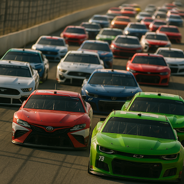
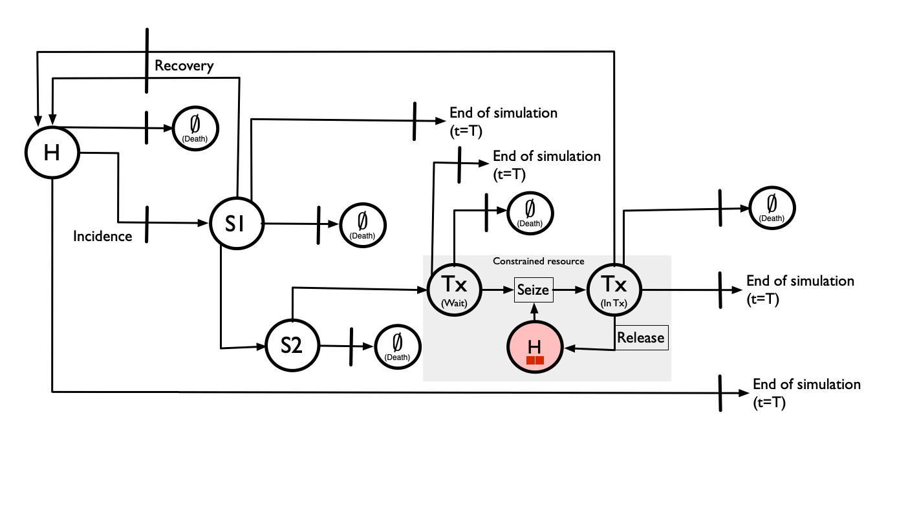
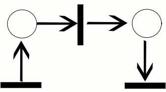
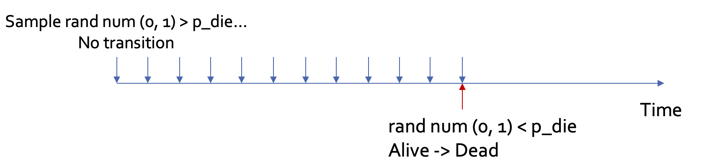
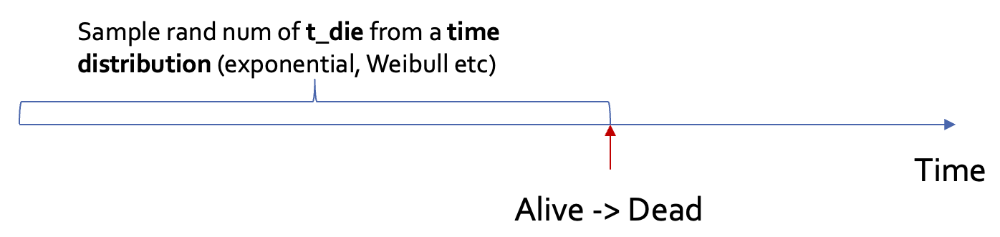
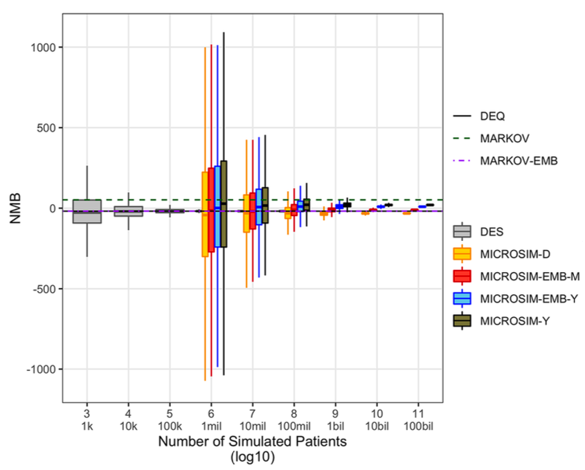

:::{.cr-section}
@cr-carrace Imagine a car race in which each patient represents a driver navigating a complex circuit with multiple checkpoints, pit stops, and potential hazards. 

:::{#cr-carrace}

:::

@cr-carrace2  In this framework, each driver follows its own unique journey ("trajectory") through a race course, with discrete events corresponding to key moments like crossing timing markers, making pit stops for fuel and tire changes, or experiencing unexpected mechanical issues that require assistance. 

:::{#cr-carrace2}

:::

@cr-carrace2 In a DES, we track not only each car's total race time but also the precise timing and sequence of significant events. 

:::{#cr-carrace3}

:::

@cr-carrace3b When cars enter the pit lane ...

:::{#cr-carrace3b}

:::

@cr-carrace3c How long cars wait for available mechanics ... 

:::{#cr-carrace3c}

:::


@cr-carrace3d Whether a driver experiences a delay due to track congestion... 

:::{#cr-carrace3d}

:::


@cr-carrace3 ... and how these realities affect their race performance (costs, health outcomes) and resource consumption. 

:::

:::{.cr-section}

# Concepts

@cr-table To understand and construct a DES it's important to define several concepts:

@cr-table <span style="color:#DF8F44FF">**Tokens**</span> represent an individual entity (typically a patient) that flows through the simulation over time.

@cr-table When it comes to visualising a DES it's common to use solid shapes like squares and circles. 

@cr-petri-token2 A patient is represented by a solid black circle ...

[@cr-petri-token1]{scale-by="2"} ... while a hospital is represented by a solid red rectangle. 

@cr-petri-token-queue In that way, we can both conceptualize and model instances where hospital capacity is constrained, creating queues and wait times that delay time to treatment. 

:::{#cr-petri-token-queue}

:::

:::{#cr-petri-token1}

:::

:::{#cr-petri-token2}

:::


@cr-table Tokens take on [**attributes**]{style="color:crimson"} (e.g., age, gender) that are either fixed throughout the model, or that change as they make their way through the model. 

@cr-table For example, suppose we aim to model different strategies for treating colon cancer. A token might represent a 67-year-old woman with Stage III colorectal cancer.


:::{#cr-table}
```{r}

library(knitr)
library(scales)
#show_col(ggsci::pal_jama("default")(6))

des_table <- data.frame(
  Concept = c("<span style='color:#DF8F44FF'>**Tokens**</span>", 
              "<span style='color:#6A6599FF'>**Places**</span>",
              "<span style='color:#00A1D5FF'>**Events/transitions**</span>", 
              "<span style='color:#B24745FF'>**Trajectories**</span>", 
              "<span style='color:#79AF97FF'>**Resources**</span>"),
  Definition = c(
    "Represent patients or units flowing through the simulation, carrying attributes.",
    "Indicate system states or conditions (e.g., “Healthy,” “Sick,” “Under Treatment”)",
    "Discrete time points when system state changes; trigger resource use and transitions.",
    "The sequence of events and states a token experiences during the simulation.",
    "Entities required or consumed by events; may be limited (constrained) or unlimited (unconstrained)."
  ),
  Examples = c(
    "A 67-year-old woman with Stage III colorectal cancer.",
    "Sick disease state",
    paste("- Disease incidence<br>",
          "- Disease progression<br>",
          "- Death from disease or background causes<br>",
          "- Enter treatment waiting list<br>",
          "- Acute event (e.g., hospitalization)"),
    "Patient progresses from diagnosis → treatment → remission → relapse → death",
    paste("- Total time in healthy state<br>",
          "- Total time in sick state<br>",
          "- Number of available hospital beds")
  ),
  stringsAsFactors = FALSE
)

des_table_ <- des_table[1,]

kable(des_table_)
```

:::

:::{#cr-table2}
```{r}
des_table_ <- des_table[1:2,]
kable(des_table_)
```
:::

Tokens reside in <span style='color:#6A6599FF'>**Places, **</span> @cr-table2 which indicate system states or conditions (e.g., "Healthy," "Sick," "Dead") @cr-petri-place

:::{#cr-petri-place}

:::

@cr-table2 For many health decision models, places are simply health states. 

But for a resource-constrained model, places could also represent hospitals, treatment slots, etc. [@cr-model6place]{pan-to="-25%, -50%" scale-by="2"}

:::{#cr-model6place}

:::

Now suppose we want to track this patient's progression through diagnosis, treatment (e.g., surgery, chemo), remission, and potential relapse. These are examples of <span style="color:#00A1D5FF">**events/transitions**</span> in a DES model.  @cr-table3

Transitions are often denoted by bars or rectangles that denote discrete system state changes. @cr-petri-transition

For example, disease incidence would be captured by a transition. [@cr-model6place]{pan-to="100%, 15%" scale-by="3"}

:::{#cr-petri-transition}

:::

The flow between <span style='color:#6A6599FF'>**places**</span> and <span style='color:#00A1D5FF'>**transitions**</span> is denoted by an **arc**. @cr-petri-arc

:::{#cr-petri-arc}

:::

:::{#cr-table3}
```{r}
des_table_ <- des_table[1:3,]
kable(des_table_)
```
:::


@cr-petrigif These visual tools can be combined into a **Petri net** diagram that represents the flow of resources, entities, and control through a system over time. Petri nets are particularly useful for depicting concurrent processes and shared resources.  


Formally, a Petri net is a directed bipartite graph that describes a distributed system. @cr-petrigif

@cr-petrigif In the example shown to the right, each transition moves a token through the system. 

:::{#cr-petrigif}

<figcaption>Source: [Wikipedia](https://en.wikipedia.org/wiki/Petri_net)</figcaption> 
:::


@cr-fullpetri Our ultimate objective is to build up a DES based on the following Petri net diagram for the progressive disease model with resource constraints.


:::{#cr-fullpetri}

:::

:::{#cr-petritablefull}
| Element | Type | Description |
|:-----------------------:|:------------:|:--------------------------------|
|  | **Place** | Indicate system states or conditions (e.g., “Healthy,” “Sick,” “Under Treatment”). |
|  | **Transition** | Signify events that may cause a change in state (e.g., “disease incidence,” “death,” “recovery”). |
| {width="45"}  | **Token** | Represent individual entities (e.g., patients, hospital beds or available treatment slots) that flow through the net. |
|  | **Arc** | Show the flow between places and transitions. |
:::


@cr-petritablefull Once we have represented the system, we need some way to record the experience of each token (i.e., patient) in the system. This is accomplished via a <span style='color:#B24745FF'>**trajectory**</span> 

@cr-table4 A <span style="color:#B24745FF">**trajectory**</span> captures the specific sequence of events a patient  experiences. 

:::{#cr-table4}
```{r}
des_table_ <- des_table[1:4,]
kable(des_table_)
```
:::

As the token/patient progresses through the model, they "consume" <span style="color:#79AF97FF">**resources**</span>. @cr-table5

You can think of <span style="color:#79AF97FF">**resources**</span> as things we want to track, such as time in the model, time in the healthy state, waiting times for treatment, etc. @cr-table5

In that sense, <span style="color:#79AF97FF">**resources**</span> can be either subject to constraints, or not.  @cr-table5

A patient's experience of time in a place or health state, for example, can be thought of as unconstrained resource: one patient's experience of time does not preclude another patient in the model from also experiencing the passage of time. @cr-table5

Conversely, in a resource-constrained DES we might want to put limits on the total number of patients who can receive treatment at one time. This both helps better represent real-world scenarios, and also facilitates additional policy strategy modeling (e.g., expansion of treatment slots, staffing, or hospital beds to reduce wait times). @cr-table5

:::{#cr-table5}
```{r}
kable(des_table)
```
:::


:::


# Computational Considerations

:::{.cr-section}
@cr-convergence We established earlier that DES can significantly outperform microsimulation---needing far fewer simulated patients to converge to the "truth."

@cr-convergence This is because DES does not suffer from **truncation bias,** or the increase in variance in a model because the precise timing of events is not rounded to the cycle boundary.

@cr-convergence Recall that you can reduce truncation bias in microsimulation by using a **shorter cycle length**. But [this does not really ease the computational demands.]{style="color:crimson"} Why?

A microsimulation must take a snapshot of occupancy at **every cycle**---even though in many cycles, [**no event will have occurred!**]{style="color:crimson"}. @cr-microdes1

In a DES, once an event occurs, we **skip forward** to the next event---whenever it may occur in the future! @cr-microdes2

This saves us a lot on computational demands, since we don't have to check in every cycle. @cr-microdes2

:::{#cr-microdes1}

:::

:::{#cr-microdes2}

:::

:::{#cr-convergence}

:::

@cr-microdes2 There are some other relevant computational considerations, however...


@cr-simmer  We have built a modelling platform with health economic wrapper functions based on the R package [**simmer**](https://r-simmer.org). 

@cr-simmer  **simmer** is a process-oriented and trajectory-based DES platform that facilitates generic DES models. 

:::{#cr-simmer}

:::


@cr-simmer  A **simmer** DES framework executes all trajectories at the same time, evaluating them all to check for any resource contention. 

@cr-simmer  Thus, there is a computational penalty for handling resource contention--and **this penalty remains fixed regardless of whether the underlying model has resource constraints!**

@cr-simmer  To put this issue in perspective, independently-run simulations are $\mathcal{O}(n)$ in complexity of execution. 

@cr-simmer  This means the total runtime / memory utilisation is proportional to the number of patients simulated. 

@cr-simmer A DES model run in **simmer** requires the fixed cost of resource contention checking. 

@cr-simmer That is, the model constantly checks questions like "Can Patient A get a bed when Patient B is already using one?"

@cr-simmer So if you don't have constrained resources (e.g., hospital beds), it's like having a bouncer at the door of an empty venue. 

@cr-simmer **simmer** manages this utilizing a "heap" that makes the complexity $\mathcal{O}(n \log n)$

@cr-convergence Our convergence plot earlier uses the data.table package and programs the DES directly. 

@cr-desdt But if we shift to **simmer**, model performance drags a bit more. 

@cr-clock With all that said, a **simmer** model run for a single strategy in the example progressive disease model we'll run takes about [**75 seconds**]{style="color:crimson"} with 10,000 patients. 

@cr-convergence In this convergence plot, by 10k patients the DES has already converged quite a bit on the "truth." 

:::{#cr-clock}

:::


:::{#cr-desdt}

:::
:::

<!-- # Extra Stuff -->

<!-- <span class="hl hl-blue">blue highlighted text</span>  -->
<!-- <span class="hl hl-red">red highlighted text</span>  -->
<!-- <span class="hl hl-cyan">cyan highlighted text</span>  -->
<!-- <span class="hl hl-green">green highlighted text</span>  -->
<!-- <span class="hl hl-brown">brown highlighted text</span>  -->

<!-- Here's some <span style="color:cornflowerblue">**some bolded blue text**</span> -->
<!-- How about some <span style="color:firebrick">**red bolded text**</span> -->
<!-- How about some <span style="color:darkcyan">**cyan bolded text**</span>  -->


