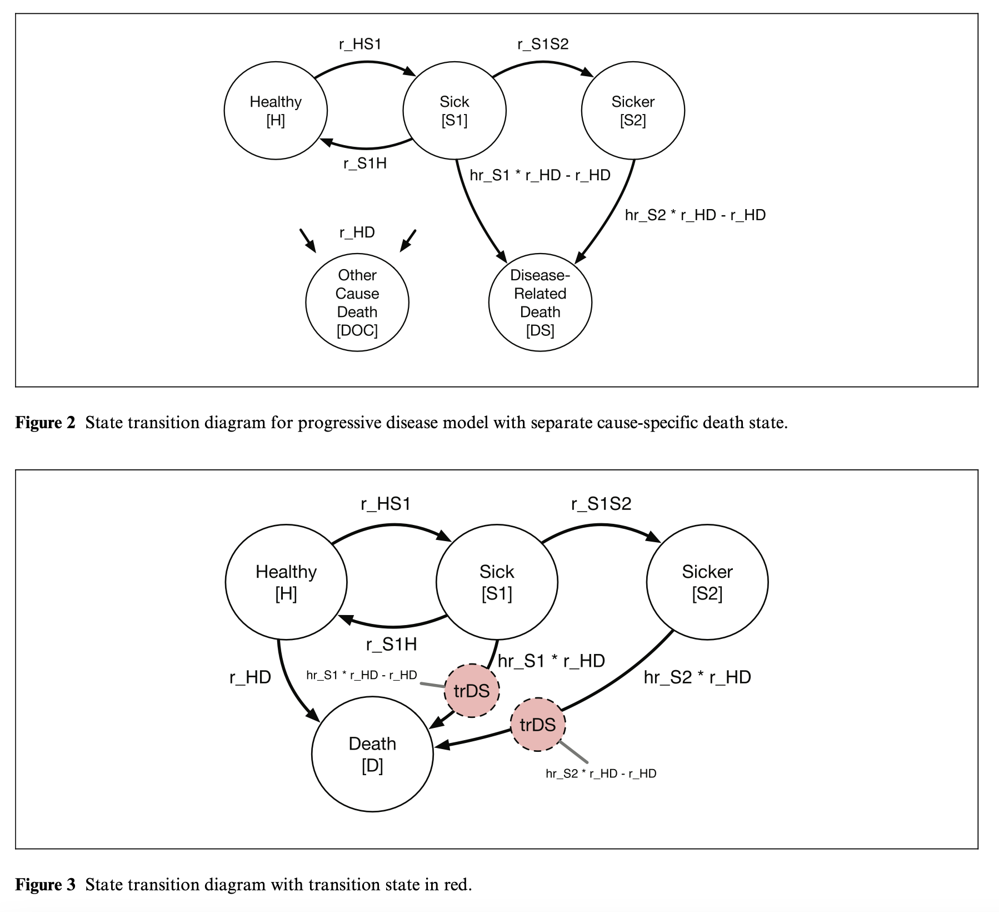
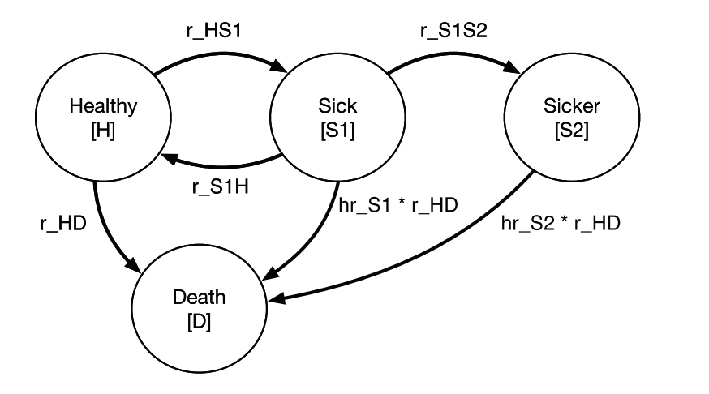
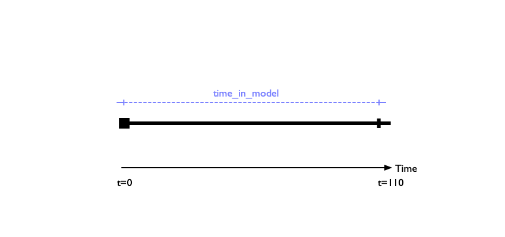
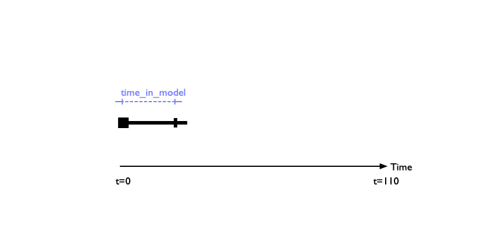
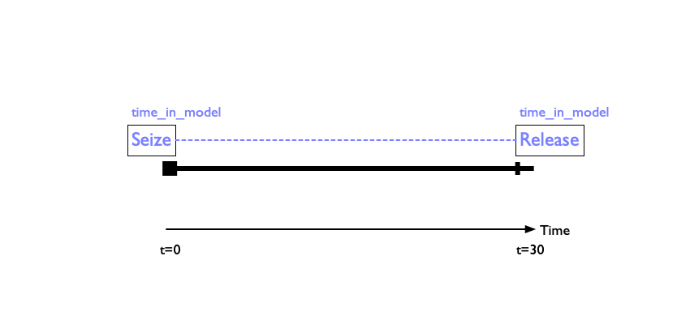
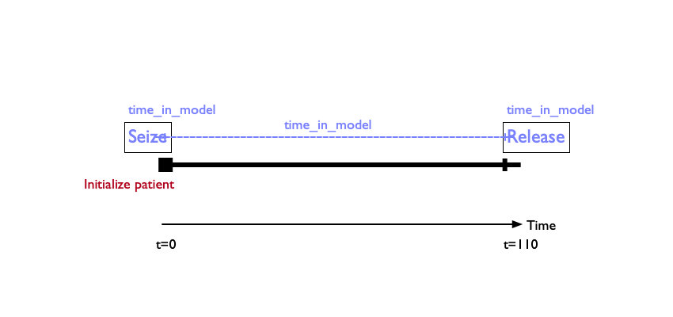
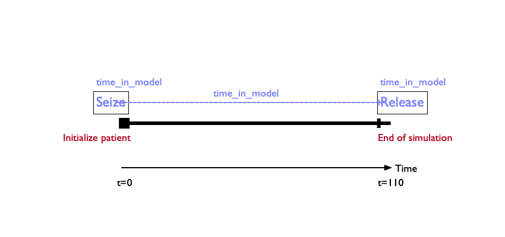

```{r setup}
#| echo: false
#| warning: false
#| message: false

library(simmer)
library(here)

source(here('R/inputs.R'))     # Model Parameters
inputs <- modifyList(inputs,list(min_age = 20, max_age = 30))
source(here('R/main_loop.R'))  # Helper functions
source(here('R/discount.R'))   # Discounting functions
```


:::{.cr-section}

@cr-bubble We will build up a DES that replicates the parameters and processes governing the progressive disease model in @alarid2023introductory. 

@cr-daly This tutorial extends our more recent work taking the same model and demonstrating how to structure it to accurately estimate Disability-Adjusted Life Year (DALY) outcomes, published earlier this year in *Medical Decision Making* [@leech2025modeling]. 

:::{#cr-daly}

:::

[@cr-bubble]{pan-to="50%,0%"} Patients start off healthy, and can then progress into progressive disease states ("Sick [S1]," "Sicker [S2]")---all while facing risks of death due to background causes, and heightened risk of death while sick.  

@cr-petri1  We will incrementally build up a Petri net diagram representing the same disease process.   

Doing so will allow us to expand the decision problem to consider an additional dimension---resource contention for a scarce treatment---that is difficult/impossible to capture in Markov and microsimulation modeling approaches. @cr-petri2

:::{#cr-bubble}
{fig-align="center"}
:::

:::{#cr-petri1}

:::

:::{#cr-petri2}

:::


:::


:::{.cr-section}

@cr-model1token  We start with a simple model that follows patients for $T$ time units. 

In this simple model, we have a population of "tokens" that start off in the healthy state. [@cr-model1token]{pan-to="65%, 20%" scale-by="1.5"}

For ease of visualisation, we'll suppress the patient tokens for the remainder 
of our model diagram buildup. [@cr-model1token]{pan-to="65%, 20%" scale-by="1.5"}

To begin, we will assume this population can only experience one event: $\,$ [@cr-model1]{pan-to="-50%, -35%"} reaching the end of the simulation at some time T. 

@cr-model1

:::{#cr-model1}
{fig-align="center"}
:::

:::{#cr-model1token}
{fig-align="center"}
:::
:::


:::{.cr-section}

Our first step is to define the parameters governing the simulation. In this case the list of parameters is small. @cr-inputs0

:::{#cr-inputs0}
```{r}
#| echo: true
#| warning: false
#| message: false
#| code-line-numbers: true
#| 
inputs <- list(
    N       = 1,  # Total number of patients to simulate. 
    horizon = 110,  # Time horizon (years)
    min_age = 20,
    max_age = 30
)

```
:::
:::

:::{.cr-section}

:::{#cr-model1_2}
{fig-align="center"}
:::

@cr-model1_2 We next need to step back and think about two concepts we defined earlier: <span style="color:#79AF97FF">**resources**</span> and <span style="color:#B24745FF">**events**</span>. 

@cr-model1_2 Let's think first about <span style="color:#79AF97FF">**resources**</span>. 

@cr-model1_2 [Resources]{style="color:#79AF97FF"} are elements that a patient may use or consume during their time in the simulation. 

@cr-model1_2 We use the terms **"use"** and **"consume"** somewhat loosely here, because a resource could be something like a hospital bed that is needed for treatment---or it could simply be an element like time that is not constrained. 

@cr-model1_2 In this very simple model, we need to conceptualize our first resource, which is <span style="color:#79AF97FF">**time in model**</span>. 

The image here shows a single patient trajectory over time. We begin tracking the patient at baseline (t=0) and follow them until the end of the time horizon has been met at 30 years. @cr-model1-resources0

We can therefore define a resource called <span style="color:#79AF97FF">**time in model**</span> that we track. In this case, it will trivially be 30 years for every simulated patient.  @cr-model1-resources1 

:::{#cr-model1-resources0}

:::

:::{#cr-model1-resources1}

:::

But that does not always need to be the case! Suppose the patient dies at some time before t=30. In that case, their time in the model will be shorter. @cr-model1-resources1-death

:::{#cr-model1-resources1-death}

:::

 @cr-model1-resources1-death It's also important to note that in this example patient trajectory, the resource `time_in_model` is unconstrained. That is, one simulated patient's experience of time does not inhibit or limit another patient from also experiencing the elapse of time. 

@cr-model1-resources1 Because the patient is followed for a defined time horizon, we can think of the resource as beginning at the initiation of the model, and ending after the time horizon is met. 

@cr-model1-resources2 The way DES conceptualizes this idea is that the [resource]{style="color:#79AF97FF"} is "seized" upon initiation of the model, and then "released" upon exit from the model. These two time stamps can then be used to calculate the total time the resource was "used." 

:::{#cr-model1-resources1}

:::

@cr-model1-resources2 Often, the seizure and/or release of resources is triggered by <span style="color:#F44336">**events**</span>. We'll cover how to handle events in just a bit. 

:::{#cr-model1-resources2}

:::


@cr-countertable0 Resources are tracked in a `counter` object. In this very simple model, we only have a single resource to track: `time_in_model`.

:::{#cr-countertable0}
: DES Model Counters

| counter | description |
|---------|-------------|
| time_in_model | Time (years) patient is tracked in model |
:::

In R, the object `counters` is defined as a vector listing the various resources that we want to track in the model. @cr-counter0 

:::{#cr-counter0}
```{r}
#| echo: true
#| warning: false
#| message: false
#| code-line-numbers: true
#| 
counters <- c(
  "time_in_model"
)

```
:::

@cr-counter0 Our next step is to define <span style="color:#F44336">**events**</span>. In this simple model, we have two:

@cr-counter0 1. Model initiation 
  
@cr-counter0 2. Model exit after the specified horizon has been reached. 

@cr-model1-event1 Both of these events trigger resource seizure and/or release, in the sense that when a patient is initialized in the model,
we want to start the clock on the `time_in_model` counter. [@cr-model1-event2]{pan-to="50%, -60%" scale-by="2"}

And similarly, when the patient reaches the event of exiting the model at the defined time horizon, we want to stop the clock on `time_in_model`.  [@cr-model1-event2]{pan-to="-50%, -60%" scale-by="2"}


:::{#cr-model1-event1}

:::

:::{#cr-model1-event2}

:::


@cr-model1-event2 In the R/Simmer simulation environment, events are handled through functions that modify the trajectory of the patient.

Let's start by defining an event for model initialization. @cr-Rinitialize1

:::{#cr-Rinitialize1}
```{r}
#| echo: true
#| warning: false
#| message: false
#| code-line-numbers: true
initialize_patient <- function(traj, inputs)
{
  traj                   |>
  seize("time_in_model") 
}
```
:::

:::{#cr-Rinitialize2}
```{r}
#| echo: true
#| warning: false
#| message: false
#| code-line-numbers: true
initialize_patient <- function(traj, inputs)
{
  traj                   |>
  seize("time_in_model") |>
  set_attribute("AgeInitial", function() sample(inputs$min_age:inputs$max_age, 1))
}
```
:::

[@cr-Rinitialize1]{highlight="1"} `initialize_patient` is a function of both **inputs** (i.e., the parameters governing the model) and [**trajectories**]{style="color:#B24745FF"}. 

[@cr-Rinitialize1]{highlight="3"} It takes the patient's trajectory and **seizes** the resource `time_in_model` that we defined above. [@cr-Rinitialize1]{highlight="4"}

[@cr-model1-event2]{pan-to="50%, -60%" scale-by="2"} Going back to the single patient trajectory, upon initilization of the patient we have "seized" the `time_in_model` resource for this patient. 

[@cr-Rinitialize2]{highlight="5"} Though we don't need it for this very simple model, `initialize_patient` is also a good place to set initial attributes of patients, such as their age, gender, etc. 

[@cr-Rinitialize2]{highlight="5"} We can then use (and update!) these attributes in the model so they can govern transitions and other events. 

@cr-Rinitialize2 Let's now construct a similar function `terminate_simulation()` that releases the resource `time_in_model` once a patient exits the model. 


:::


:::{.cr-section}

:::{#cr-Rcleanup0}
```{r}
#| echo: true
#| warning: false
#| message: false
#| code-line-numbers: true

terminate_simulation <- function(traj, inputs)
{
  traj |>
  branch( function() 1, 
          continue=FALSE,
          trajectory() |> 
            release("time_in_model")
        )
}
```
:::

[@cr-Rcleanup0]{highlight="4"}  In this function, we take the patient's trajectory and introduce a **branch**. You can think of this like a chance node in a decision tree---this puts our patient at a fork in the road, and each pathway has its own probability of being taken.

[@cr-Rcleanup0]{highlight="4"}  In this case, however, the patient is exiting the model. So this is a trivial function with only one option that has a probability of one. 

[@cr-Rcleanup0]{highlight="5"} The option `continue` is also set to false---indicating that after this branch has been passed, the model will stop running.  

@cr-Rcleanup0 Branches are key coding elements of DES, and allow for updating event times and other aspects of the model that may change over time, or probabilistically due to the occurance of events. In the event a branch is used to update attributes or event times, you woulld set `continue=TRUE`. 

@cr-Rcleanup0Branches Branches will also be key for how we conceptualize and model resource constraints later on.


[@cr-Rcleanup0]{highlight="7"} Once the patient has passed through the branch, we release the resource `time_in_model`. 

@cr-Rcleanup1 In our experience, it is often helpful to split this process into two parts: <span class="hl hl-cyan">A function that releases any resources on exit</span>. [@cr-Rcleanup1]{highlight="1-5"} 


[@cr-Rcleanup1]{highlight="7-15"} And a separate <span class="hl hl-cyan">function that terminates the simulation</span> . 


:::{#cr-Rcleanup1}
```{r}
#| echo: true
#| warning: false
#| message: false
#| code-line-numbers: true

cleanup_on_termination <- function(traj)
{
  traj |> 
  release("time_in_model")
}

terminate_simulation <- function(traj, inputs)
{
  traj |>
  branch( function() 1, 
          continue=FALSE,
          trajectory() |> 
            cleanup_on_termination()
        )
}
```
:::


:::{#cr-Rcleanup1}
```{r}
#| echo: true
#| warning: false
#| message: false
#| code-line-numbers: true

cleanup_on_termination <- function(traj)
{
  traj |> 
  release("time_in_model")
}
```
:::


@cr-Rcleanup2

:::{#cr-Rcleanup2}
```{r}
#| echo: true
#| warning: false
#| message: false
#| code-line-numbers: true

terminate_simulation <- function(traj, inputs)
{
  traj |>
  branch( function() 1, 
          continue=FALSE,
          trajectory() |> cleanup_on_termination()
        )
}
```
:::

Eventually, once the model is run, we want to return an [**Event Registry**]{style="color:#F44336"} which records all relevant events and when they happened. In this case, the only event of interest is a transition out of the model once the time horizon has been reached. @cr-Reventreg

:::{#cr-Reventreg}
```{r}
#| echo: true
#| warning: false
#| message: false
#| code-line-numbers: true
event_registry <- list(
  list(name          = "Terminate at time horizon",
       attr          = "aTerminate",
       time_to_event = function(inputs) inputs$horizon-now(env),
       func          = terminate_simulation,
       reactive      = FALSE)
)
```
:::

[@cr-Reventreg]{highlight="3"} This line defines an attribute for the patient that tells us that the patient reached the termination of the model (i.e., didn't exit for some other reason).  

[@cr-Reventreg]{highlight="4"} This line defines a function that draws the time to event. In this case, we want the event time to happen after the time horizon has been reached. 

[@cr-Reventreg]{highlight="4"} In this very simple model, there are no events that occur between $t=0$ and the time horizon. But in more complex models, other events will occur. The function therefore makes sure that the time horizon remains fixed (i.e., isn't 110 years after the last event occurs!)

[@cr-Reventreg]{highlight="5"} At the time of the event happening (i.e., reaching the time horizon) we fire off the function `terminate_simulation()` that we defined earlier.  

[@cr-Reventreg]{highlight="6"} `reactive` is an option that, if set to `TRUE`, would redraw the event time. It essentially allows for repeated events in the model. 

We're now ready to create a function that executes the model.  @cr-Rdesrun

:::{#cr-Rdesrun}
```{r}
#| echo: true
#| warning: false
#| message: false
#| code-line-numbers: true
des_run <- function(inputs)
{
  env  <<- simmer("SickSicker")
  traj <- des(env, inputs)
  env |> 
    create_counters(counters) |>
    add_generator("patient", traj, at(rep(0, inputs$N)), mon=2) |>
    run(inputs$horizon+1/365) |> # Simulate just past horizon (in years)
    wrap()
        
  get_mon_arrivals(env, per_resource = T)
}
```

:::

[@cr-Rdesrun]{highlight="1"} This function only takes the input object as its input.

[@cr-Rdesrun]{highlight="3"} It then defines a simulation environment. Think of this as a self-contained space with all the tools and objects needed to run the DES. 

[@cr-Rdesrun]{highlight="5-6"} Within this environment, we define the counters.

[@cr-Rdesrun]{highlight="7"} This line tells **simmer** that we want to generate $N$ trajectories, where $N$ is defined in `inputs` and is the total simulated patient size. Each patient starts at time 0. 

[@cr-Rdesrun]{highlight="8"} We now run the simulation just past the maximum time horizon to ensure that we capture everyone exiting the model. 

[@cr-Rdesrun]{highlight="9"} This line extracts the "monitoring statistics" from the simulation environment. These are things like arrivals, attributes, and resources in the model. This information is the ouptut of the DES model. 

@cr-Rmodel1 Let's now run the model. 

:::{#cr-Rmodel1}
```{r}
#| echo: true
#| warning: false
#| message: false
#| code-line-numbers: true
des_result <- des_run(inputs)
```

:::


```{r, echo = FALSE, output="hide"}
library(simmer)

source(here::here('R/inputs.R'))    # Your Model Parameters
source(here::here('R/main_loop.R'))  # Boilerplate code
  
# Resource or "Counters"
#
# These are used to track things that incur costs or qalys, or other
# things of which a count might be of interest.
# Infinite in quantity
counters <- c(
  "time_in_model"
)
  
# Define starting state of patient
initialize_patient <- function(traj, inputs)
{
  traj                   |>
  seize("time_in_model") |>
  set_attribute("AgeInitial", function() sample(20:30, 1))
}

# Cleanup function if a termination occurs
# Good for releasing any seized resources based on state.
cleanup_on_termination <- function(traj)
{
  traj |> 
  release("time_in_model")
}

terminate_simulation <- function(traj, inputs)
{
  traj |>
  branch( function() 1, 
          continue=FALSE,
          trajectory() |> cleanup_on_termination()
        )
}

# Main Event registry
event_registry <- list(
  list(name          = "Terminate at time horizon",
       attr          = "aTerminate",
       time_to_event = function(inputs) inputs$horizon-now(env),
       func          = terminate_simulation,
       reactive      = FALSE)
)

# This does a single DES run versus the defined inputs.
des_run <- function(inputs)
{
  env  <<- simmer("SickSicker")
  traj <- des(env, inputs)
  env |> 
    create_counters(counters) |>
    add_generator("patient", traj, at(rep(0, inputs$N)), mon=2) |>
    run(inputs$horizon+1/365) |> # Simulate just past horizon (in years)
    wrap()
        
  get_mon_arrivals(env, per_resource = T)
}

set.seed(1)
inputs <- modifyList(inputs,list(horizon=   110))
res_model0 <- des_run(inputs) %>% knitr::kable()
```

@cr-Rmodel0result The table shown here contains the model results. As we can see, we have four patients, each of whom is in the model for 110 years.  

:::{#cr-Rmodel0result}
```{r}
res_model0 
```

:::

Let's now add in death as another event. @cr-model2 

:::{#cr-model2}
{fig-align="center"}
:::

From the healthy state we now have a <span style="color:#00A1D5FF">**transition**</span>[@cr-model2]{pan-to="50%,50%" scale-by="2.5"}


:::{#cr-counter1}
```{r}
#| echo: true
#| warning: false
#| message: false
#| code-line-numbers: true
#| 
counters <- c(
  "time_in_model",
  "death"
)

```
:::


@cr-counter1 We add death to `counters`, as this is something we want to track in the model. 

@cr-inputs1 In the original progressive disease model we're replicating, death is a constant
rate, which we now define in inputs.

:::{#cr-inputs1}
```{r}
#| echo: true
#| warning: false
#| message: false
#| code-line-numbers: true
#| 
inputs <- list(
    N       = 1,  # Total number of patients to simulate. 
    horizon = 110,  # Time horizon (years)
    min_age = 20,
    max_age = 30,
    r.HD   =  0.005  # Death rate / year   
)

```
:::

@cr-Reventdeath1 We now need to define a function that draws a random time of death for every simluated patient. This function is simply an exponential draw based on the exponential death rate defined in `inputs`.

:::{#cr-Reventdeath1}
```{r}
#| echo: true
#| warning: false
#| message: false
#| code-line-numbers: true
years_till_death <- function(inputs)
{
  rexp(1, inputs$r.HD)
}

```
:::

@cr-Reventdeath1b Now we need to define a function that specifies *what happens* when someone dies. 

[@cr-Reventdeath1b]{highlight="3-5"} Once again we use a **branch** with only one option, and set `continue=FALSE` because we do not want the patient to continue in the model after they die.

[@cr-Reventdeath1b]{highlight="6-8"}  Once the patient dies, we want to record their death time and then terminate the simulation (i.e., release `time_in_model`, etc.) for that patient. 

:::{#cr-Reventdeath1b}
```{r}
#| echo: true
#| warning: false
#| message: false
#| code-line-numbers: true
death <- function(traj, inputs)
{
  traj |> branch(
    function() 1,
    continue=c(FALSE), 
    trajectory("Death") |>
      mark("death")     |> # Must be in 'counters'
      terminate_simulation()
  )
}
```

:::

@cr-Reventreg1 Finally, we want our output to record the time of death for each patient who dies. We add death as something we record in the event registry.

[@cr-Reventreg1]{highlight="8"} Every patient that dies gets an attribute telling us that they died. 

[@cr-Reventreg1]{highlight="9"} The time to this event occurring is defined by the `years_to_death()` function we just defined earlier. 

[@cr-Reventreg1]{highlight="10"} Similarly, the function that fires at the time of death is the `death()` function we just finished defining. 

[@cr-Reventreg1]{highlight="11"} We set `reactive` to `FALSE` because death is a terminal event; we don't want people to live more than once!


:::{#cr-Reventreg1}
```{r}
#| echo: true
#| warning: false
#| message: false
#| code-line-numbers: true
event_registry <- list(
  list(name          = "Terminate at time horizon",
       attr          = "aTerminate",
       time_to_event = function(inputs) inputs$horizon-now(env),
       func          = terminate_simulation,
       reactive      = FALSE),
  list(name          = "Death",
       attr          = "aDeath",
       time_to_event = years_till_death,
       func          = death,
       reactive      = FALSE)
)
```
:::

```{r, echo = FALSE, output="hide"}
library(simmer)

source(here::here('R/discount.R'))
source(here::here('R/inputs.R'))     # Your Model Parameters
source(here::here('R/main_loop.R'))  # Boilerplate code
source(here::here('R/event_death.R'))
  
# Resource or "Counters"
#
# These are used to track things that incur costs or qalys, or other
# things of which a count might be of interest.
# Infinite in quantity
counters <- c(
  "time_in_model",
  "death"
)
  
# Define starting state of patient
initialize_patient <- function(traj, inputs)
{
  traj                   |>
  seize("time_in_model") |>
  set_attribute("AgeInitial", function() sample(20:30, 1))
}

# Cleanup function if a termination occurs
# Good for releasing any seized resources based on state.
cleanup_on_termination <- function(traj)
{
  traj |> 
  release("time_in_model")
}

terminate_simulation <- function(traj, inputs)
{
  traj |>
  branch( function() 1, 
          continue=FALSE,
          trajectory() |> cleanup_on_termination()
        )
}

# Main Event registry
event_registry <- list(
  list(name          = "Terminate at time horizon",
       attr          = "aTerminate",
       time_to_event = function(inputs) inputs$horizon-now(env),
       func          = terminate_simulation,
       reactive      = FALSE),
  list(name          = "Death",
       attr          = "aDeath",
       time_to_event = years_till_death,
       func          = death,
       reactive      = FALSE)
)

cost_arrivals <- function(arrivals, inputs)
{
  arrivals$cost  <- 0  # No costs yet
  arrivals$dcost <- 0  # No discounted costs either
  
  arrivals
}

qaly_arrivals <- function(arrivals, inputs)
{
  arrivals$qaly  <- 0  # No qaly yet
  arrivals$dqaly <- 0  # No discounted qaly either
  
  selector <- arrivals$resource == 'time_in_model'
  arrivals$qaly[selector] <-
    arrivals$end_time[selector] - 
    arrivals$start_time[selector]
  arrivals$dqaly[selector] <- 
      discount_value(1, 
                     arrivals$start_time[selector],
                     arrivals$end_time[selector])
    
  arrivals
}

# This does a single DES run versus the defined inputs.
des_run <- function(inputs)
{
  env  <<- simmer("SickSicker")
  traj <- des(env, inputs)
  env |> 
    create_counters(counters) |>
    add_generator("patient", traj, at(rep(0, inputs$N)), mon=2) |>
    run(inputs$horizon+1/365) |> # Simulate just past horizon (in years)
    wrap()
        
  get_mon_arrivals(env, per_resource = T) 
}

set.seed(1)
inputs <- modifyList(inputs,list(horizon=   110))
res_model1 <- des_run(inputs) %>% knitr::kable()

```


@cr-Rmodel1result  As the table demonstrates, three of the four simulated patients died before the model horizon was reached. 

:::{#cr-Rmodel1result}
```{r}
res_model1 
```

:::
:::


