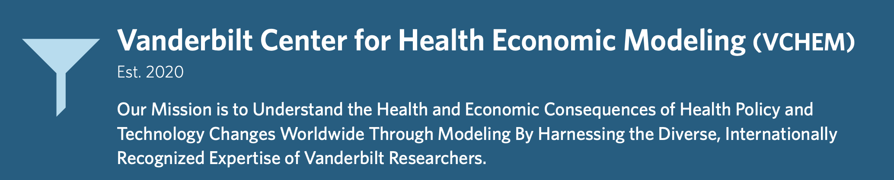

### Workshop Website: https://graveja0.github.io/des-workshop-2025/

:::.column-page

:::

This mini-workshop will introduce participants to discrete event simulation (DES) as a tool for policy evaluation and health technology assessment. Participants will be introduced to key concepts for conceptualising and visualising DES models, and will be led through a progressive disease DES that replicates results from a widely-used didactic model. Additional topics will include computational issues and considerations, and a comparison of DES with other modelling frameworks including discrete time Markov cohort and microsimulation modelling. We will round out our time together by discussing novel extensions of DES into concepts that are difficult if not impossible to capture in other health economic modelling environments, including resource contention and other interactions amongst patients, capacity constraints, and treatment queues and wait times.

[Read more about the Vanderbilt Center for Health Economic Modeling](images/about-vchem.pdf)

## Model Diagram for the Example Progressive Disease Model

::: screen-page

:::

## [Posit.Cloud Modelling Workspace](https://posit.cloud/content/10570508)

All models discussed today are provided alongside a fully functional R workspace on posit.cloud. [Please follow this link to access](https://posit.cloud/content/10570508). Note that you must have an operational (free) posit.cloud account to access.

## [Part 1: Overview of DES](content/01_oxford-des.qmd)

## [Part 2: Conceptual and Computational Issues](content/02-oxford-des.qmd)

## [Part 3: Alive-Dead DES](content/03-oxford-des.qmd)

## [Part 4: Alive-Sick Dead DES](content/04-oxford-des.qmd)

